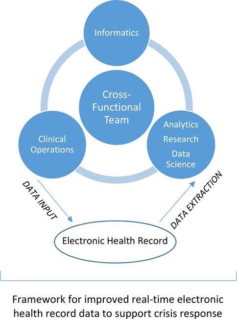
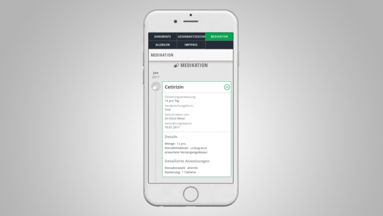

# The Digitalization of Patient Medical Records

## Breaking It Down

  As innovation and advancements arise in every sector, the medical sector isn’t left behind. Electronic health records (EHRs) have come a long way in the past years and the COVID-19 pandemic was a catalyst in countries’ effort in digitalizing their systems. As defined by ISO/DTR 20514, electronic medical records are a ”repository of information regarding the health of a subject of care in computer-processed form that is able to be stored and transmitted securely and is accessible by multiple authorized users.” [^2] 

*Image courtesy of GHP [^6]*

  However, Electronic Health Records (EHRs) and Electronic Medical Records (EMRs) are terms that have been used interchangeably, thus the main difference isn’t taken into consideration. During a patient’s visit, a chart is created to document their symptoms, vitals, any results for tests conducted, and any medical history relevant. Any medication prescribed is also included in the patient’s chart and it stays within the organization. A digital version of this chart is an Electronic Health Record and it’s stored on the medical institution’s computer system. [^3]

Electronic Health Records include all the above and more. It is a digital record of a patient’s medical journey is the way I like to put it. It includes the patient’s chart for every visit, along side past medical history, any allergies, all lab data conducted, imaging reports, and more. While this digital record is used by an institution’s computer system, it is stored in a system that can be shared and accessed with all medical providers, ones that are part of the patient’s care. Therefore, any hospital, clinic, medical office, etc can access a patient’s medical information as the patent visits them [^3].

*Image courtesy of the Journal of Biomedical Informatics [^5]*

## COVID’s Impact on EHRs
Countries all around the world were faced with challenges when the pandemic hit, some were prepared, and some weren’t. How and why that was the case comes down to many different reasons, but one thing that changed is their computer systems. United States’ California hospitals are one example of this need for change. 

With such a large number of people being affected causing hospitals to keep track of who’s coming in and out and if they are COVID cases or not, and a lot more. California hospitals had daily and weekly reports that needed to be sent out and their system, while digital wasn’t developed enough to maintain various data elements. They were mainly used for billing and patient care, thus not providing high quality data to be reported [^5]. 

Having an efficient computer system is vital as the data would aid in the nation’s pandemic response and crisis planning. It needed to happen at a fast speed and be of high quality and having an HER system would’ve been able to withstand the demand for information and data.

## Why Use EHRs?
Medical institutions around the world have been using their computer systems for years, therefore the question arises as to why change that system now? One of the main reasons is that we are now becoming a digital world and having a paperless medical history is supporting the efficiency and quality of the integrated healthcare system. These records can be accessed anytime and anywhere and can help plan treatment efficiently and effectively wherever the patient is. This also helps medical institutions and stakeholders gather, maintain, and receive patients’ health information easily [^2].

As for patients, having an EHR that can be accessed by any institution they wish avoids any duplicate examinations, which saves times and costs. In addition, this provided a smooth transfer of health information from one organization to the other for any reason the patient decides to do so [^2].

## What's Stopping the Switch to EHRs?
One medical institution differs from the other, they range in size and experience, therefore some institutions find difficulty in switching to a new system due to high capital costs. It would be a huge investment to integrate an entirely new system and the return on that investment may be too small for smaller practices, clinics, and safety net providers.

The high level of skill and support needed for implementation and maintenance may not be available, therefore not being to successfully redesign clinical process to transition to the new technology systems [^1].

Another concern that was raised was regarding the security of information. Some applications being used as a digital health record were found to display advertisements and transmit data and information to third parties. This transmission of data would happen prior to any agreement to the app’s privacy policy, causing sensitive information to be released without the patient’s approval [^4].

The solutions or alternatives that have been presented and/or implemented are for medical institutions to use an EHR system that is separate from their own management system. The EHR system would only be used to access a patient’s record when granted access. Then, they would be able to view any past medical information and copy the patient’s record from their system onto the EHR system. Access rights can be revoked by the patient at any time so that certain institutions are unable to view and modify any information [^4].

## Germany's ePA and eGA

Germany has 2 types of health records: elektronische Gesundheitsakte, eGA which is a personal health record (PHR), this is currently established in most companies and Patientenakte, ePA, are electronic health records (EHR). As of March 14th 2019, German statutory health insurance started funding policyholders to be provided with electronic health records. There are specific technical requirements for a system to be classified as an HER, per Gematik, telematics applications company for the electronic health record [^4].

The German Social Security Code (§ 291a SGB V) requests that “data findings, diagnoses. Therapeutic measures, treatment reports and vaccinations for cross-case and multi-patient documentation about the patient” be stored in EHRs. The top 3 PHR systems being used in Germany are: TK-Safe, Vivy, and AOK-Gesundheitsnetzwerk. All 3 systems aren’t approved EHRs by Gematik as they don’t comply with § 291a SGB V [^4].

*Image courtesy of DAZ.online [^7]*

## Target Audience
This blog is directed to medical institutions and medical informaticians so that electronic health records can keep advancing, helping patients’ experiences become smoother. While countries like Germany, as mentioned, have started implemented similar systems, there are still ways to go to improve it and make it a true EHR.

## References

[^1]: [Electronic Medical Record Systems: Digital Healthcare Research](https://digital.ahrq.gov/electronic-medical-record-systems)
[^2]: [Digitalization of Medical Records](https://www.smart-academy.in/blog/digitalization-of-medical-records/)
[^3]: [Differences between Electronic Medical Records (EMR) and Electronic Health Records(EHR)](https://prohealthware.com/differences-between-electronic-medical-records-emr-and-electronic-health-records-ehr/)
[^4]: [EHR and PHR: Digital Records in the German Healthcare System](https://www.gesundheitsindustrie-bw.de/en/article/news/ehr-and-phr-digital-records-in-the-german-healthcare-system)
[^5]: [Mind the clinical-analytical gap: Electronic Health Records and COVID-19 Pandemic Response](https://doi.org/10.1016/j.jbi.2021.103715)
[^6]: [Why is Electronic Health Records a Good Idea for Health Care Organizations?](https://www.ghp-news.com/why-is-electronic-health-record-a-good-idea-for-health-care-organisations/)
[^7]: [Aok auf der E-health-überholspur](https://www.deutsche-apotheker zeitung.de/news/artikel/2017/10/10/aok-auf-der-digitalisierungs-ueberholspur)
